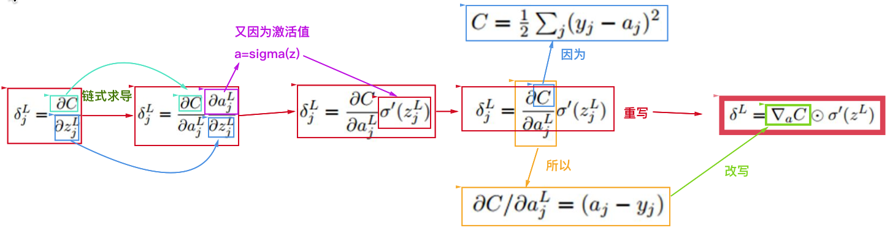
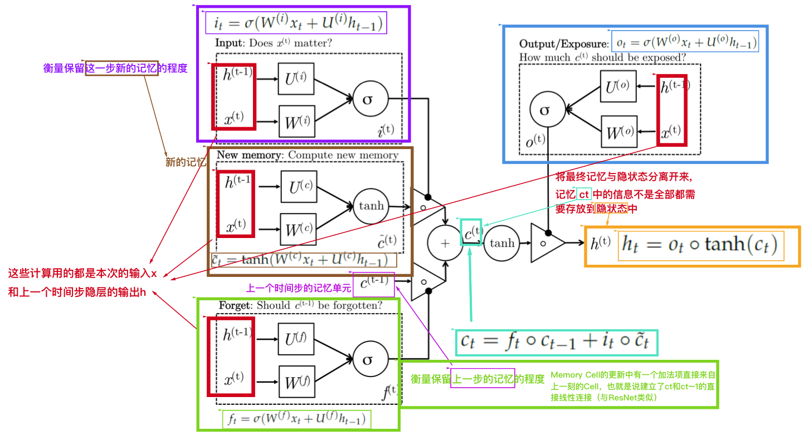
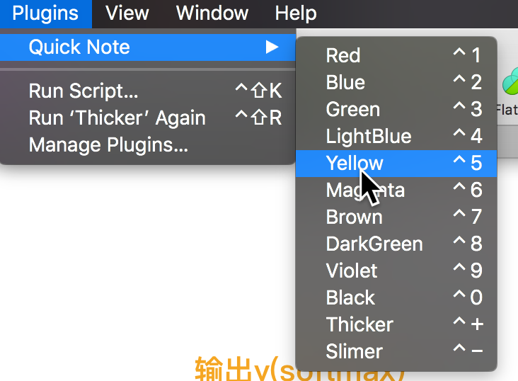

# Quick Note

Sketch Quick Note plugin.

Assigned shortcuts for coloring and adjusting thickness of text and shape. Help you make notes more efficiently!

Inspired by colesperks/QuickColor[https://github.com/colesperks/QuickColor]

# Quicklook

# Usage

# Shortcut CheatSheet

## Coloring

| shortcut | description |
| -------- | ----------- |
| ctrl + 1 | Red         |
| ctrl + 2 | Blue        |
| ctrl + 3 | Green       |
| ctrl + 4 | LightBlue   |
| ctrl + 5 | Yellow      |
| ctrl + 6 | Magenta     |
| ctrl + 7 | Brown       |
| ctrl + 8 | DarkGreen   |
| ctrl + 9 | Violet      |
| ctrl + 0 | Black       |

## Adjust Thickness

| shortcut | description B |
| -------- | ------------- |
| ctrl + + | Thicker       |
| ctrl + - | Slimmer       |
